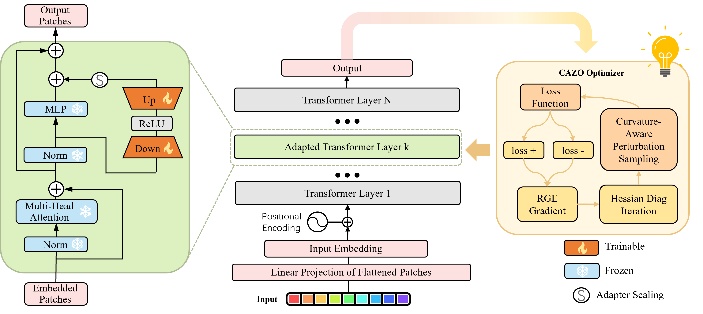

# [🏆CVPR'26] CAZO: Test-Time Adaptation with Curvature-Aware Zeroth-Order Optimization

<div align="center">
  <h2 align="center">
  <a href="https://github.com/Hollyming/CAZO" target='_blank' style="text-decoration: none;"></a>
  <a href="https://github.com/Hollyming/CAZO" target='_blank' style="text-decoration: none;"></a>
  <a href=""></a>
</div>

This repository contains the official implementation of **CAZO**, a forward-only test-time adaptation framework that leverages curvature-aware zeroth-order optimization.

> **Status**: Code release for CVPR 2026 paper (camera-ready version pending).




## Key Features

* 🚀 **Forward-Only Adaptation**: CAZO performs adaptation using only forward passes, making it:
  - Memory efficient (reduced memory usage by ~80% compared to backpropagation-based methods)
  - Compatible with quantized models
  - Suitable for specialized hardware where parameters are non-modifiable

* 🔄 **Curvature-Aware Optimization**: CAZO incorporates covariance information into the zero-order optimization process, leading to:
  - More efficient parameter updates
  - Better adaptation to distribution shifts
  - Improved convergence properties

## 📁 Project Structure

```bash
CAZO/
├── tta_library/
│   ├── CAZO.py            # CAZO
│   ├── zo_base.py         # ZO (RGE) baseline
│   ├── tent.py            # Tent baseline
│   ├── cotta.py           # CoTTA baseline
│   ├── sar.py             # SAR baseline
│   ├── t3a.py             # T3A baseline
│   ├── lame.py            # LAME baseline
│   └── foa.py             # FOA baseline
├── models/
│   ├── adaformer.py       # AdaFormer structure
│   ├── vit_adapter.py     # ViT adapter
│   ├── deit_adapter.py    # DeiT adapter
│   ├── swin_adapter.py    # Swin adapter
│   ├── vpt.py             # Vision Prompt Tuning
│   └── backbone/
├── dataset/               # Data loading
├── scripts/               # Experiment scripts
├── calibration_library/
├── quant_library/
│   └── configs/PTQ4ViT.py # Quantization config
├── utils/
├── environment.txt
└── main.py
```

---

## 🧪 Supported Settings

### TTA (Test-Time Adaptation)
- Single-domain test-time adaptation.

### CTTA (Continual Test-Time Adaptation)
- Sequential domain/corruption adaptation.
- Enable with `--continue_learning True`.

---

## ⚙️ Installation

Please use [environment.txt](environment.txt):

```bash
pip install -r environment.txt
```

If your environment does not support `pip install -r` for this format, run commands in [environment.txt](environment.txt) line by line.

---

## 🚀 Quick Start

### Example: CAZO
```bash
bash scripts/cazo.sh
```

### Example: ZO baseline
```bash
bash scripts/zo_base.sh
```

More scripts are available in [scripts/](scripts/).

---

## 📊 Main Results

### 1) TTA Results (ImageNet-C, severity level 5)

| Method | Top-1 Acc (%) | Memory (MB) |
|---|---:|---:|
| NoAdapt | 55.5 | - |
| Tent | 59.8 | 6,404 |
| CoTTA | 61.9 | 17,773 |
| SAR | 62.7 | 6,405 |
| FOA(p=28) | 65.8 | 1,553 |
| ZOA | 67.4 | 1,660 |
| **CAZO** | **69.0** | **1,695** |

---

### 2) CTTA Results (ImageNet-C, severity level 5 / Sequential Corruptions)

| Method | Top-1 Acc (%) | Memory (MB) |
|---|---:|---:|
| Tent | 60.7 | 6,404 |
| CoTTA | 58.0 | 17,773 |
| ETA | 61.7 | 6,696 |
| RoTTA | 53.1 | 9,126 |
| SAR | 61.6 | 6,405 |
| DeYO | 59.4 | 7,124 |
| LCoTTA | 62.3 | - |
| **CAZO** | **65.3** | **1,695** |

---

## 🧩 Notes

- For ImageNet-R / V2 / Sketch, set `--dataset_style imagenet_r_s_v2`.
- For quantized runs, enable `--quant`.
- For continual adaptation, set `--continue_learning True`.

---

## 📝 Citation (CVPR 2026)

```bibtex
@inproceedings{zhang2026curvature,
  title     = {Curvature-Aware Zeroth-Order Optimization for Memory-Efficient Test-Time Adaptation},
  author    = {Zhang, Junming and Yin, Shuyu and Liu, Peilin and Ying, Rendong and Wen, Fei},
  booktitle = {IEEE/CVF Conference on Computer Vision and Pattern Recognition (CVPR)},
  year      = {2026}
}
```

---

## 🙏 Acknowledgments

- [EATA](https://github.com/mr-eggplant/EATA)
- [VPT](https://github.com/KMnP/vpt)
- [FOA](https://github.com/mr-eggplant/FOA)
